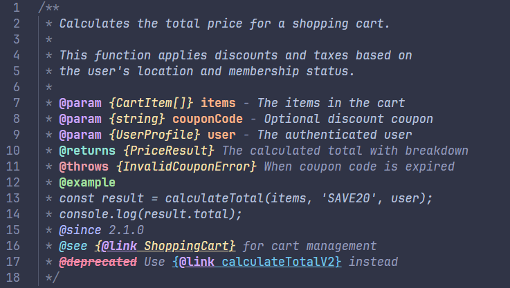

# Catppuccin TSDoc Highlighter

> _Soothing pastel TSDoc/JSDoc comment highlighting for the high-spirited!_

A Visual Studio Code extension that brings **Catppuccin's elegant pastel palette** to your TSDoc and JSDoc documentation comments. Each tag, type, parameter, and description gets its own beautiful color, making your documentation not just readable — but _gorgeous_.

## Features

- **4 Catppuccin flavors**: Mocha, Macchiato, Frappé, and Latte
- **Smart parsing**: Highlights `@param`, `@returns`, `@throws`, `@example`, `@deprecated`, `@see`, `@since`, `@link`, types `{Type}`, parameter names, and descriptions
- **Real-time**: Updates as you type with debounced rendering
- **Configurable**: Toggle italic/bold, adjust opacity, switch flavors via command palette
- **Multi-language**: Works with TypeScript, JavaScript, Java, PHP, C#, Dart, Vue, Svelte

## Color Mapping (Mocha)

| Element                     | Color               | Hex       |
| --------------------------- | ------------------- | --------- |
| `@tags` (param, type, etc.) | Mauve               | `#cba6f7` |
| `@returns` / `@return`      | Teal                | `#94e2d5` |
| `@example`                  | Green               | `#a6e3a1` |
| `@deprecated`               | Red (strikethrough) | `#f38ba8` |
| `@throws`                   | Maroon              | `#eba0ac` |
| `@see`                      | Sky                 | `#89dceb` |
| `@since` / `@version`       | Lavender            | `#b4befe` |
| Parameter names             | Peach               | `#fab387` |
| `{Types}`                   | Yellow              | `#f9e2af` |
| Descriptions                | Subtext 1           | `#bac2de` |
| `{@link ...}`               | Sapphire            | `#74c7ec` |
| `@default` values           | Flamingo            | `#f2cdcd` |
| `/**` `*/` `*` delimiters   | Overlay 1           | `#7f849c` |

## Quick Start

1. Install the extension
2. Open any TypeScript/JavaScript file with JSDoc/TSDoc comments
3. Enjoy the colors!

### Switch Flavor

Press `Ctrl+Shift+P` → `Catppuccin TSDoc: Switch Flavor` to pick from:

- **Mocha** — The Original dark theme
- **Macchiato** — Medium contrast
- **Frappé** — Muted dark
- **Latte** — Light theme

## Settings

| Setting                                    | Default | Description                   |
| ------------------------------------------ | ------- | ----------------------------- |
| `catppuccinTsdoc.flavor`                   | `mocha` | Catppuccin flavor             |
| `catppuccinTsdoc.enableItalicDescriptions` | `true`  | Italic descriptions           |
| `catppuccinTsdoc.enableBoldTags`           | `true`  | Bold tags                     |
| `catppuccinTsdoc.opacity`                  | `1`     | Highlight opacity (0.3 - 1.0) |

## Example



## Development

```bash
# Clone
git clone https://github.com/gbpardave/catppuccin-tsdoc-highlighter.git
cd catppuccin-tsdoc-highlighter

# Install & compile
npm install
npm run compile

# Test in VSCode
# Press F5 to launch Extension Development Host
```

## Instalación Local (uso personal)

```bash
# 1. Empaquetar la extensión
cd C:\Users\USER\Desktop\CRS\catppuccin-tsdoc-highlighter
npx @vscode/vsce package --allow-missing-repository

# 2. Instalar en VSCode
code --install-extension catppuccin-tsdoc-highlighter-1.0.0.vsix
```

> Si actualizas el código, repite los mismos 2 comandos para reinstalar.

## License

MIT © gbpardave

---

<p align="center">
  
</p>

<p align="center">
  Made with <a href="https://catppuccin.com">Catppuccin</a> colors
</p>
